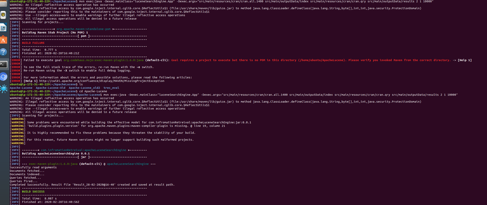
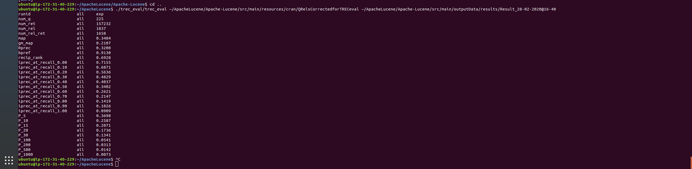

# Text Based Search Engine using Apache Lucene

Steps to run application

1. Go to the project dir
2. Inside the directory run the query - mvn clean
3. Then run - mvn install (target folder will be created)
4. Then run the command - mvn exec:java -Dexec.mainClass="luceneSearchEngine.App" -Dexec.args="src/main/resources/cran/cran.all.1400 src/main/outputData/index src/main/resources/cran/cran.qry src/main/outputData/results 2 5 10000" (2 - English Analyzer, 5 - BM25 Similarity, 10000 - hits per page). You may change the values to check other analysers and similarity scorers
5. Once completed copy the result file name from the output message and run command - cd .. (Returns to previous directory).
6. For TREC_EVAL run the command - ./trec_eval/trec_eval ~/ApacheLucene/Apache-Lucene/src/main/resources/cran/QRelsCorrectedforTRECeval ~/ApacheLucene/Apache-Lucene/src/main/outputData/results/{Result file name}

Sample output of the program

Successfully read arguments

Documents fetched...

Documents indexed...

Queries fetched...

Queries fired...

Completed Successfully. Result file 'Result_28-02-2020@15-17' created and saved at result path.

For this example {Result file name} = Result_28-02-2020@15-17

Argument List
1. DOCUMENT_PATH - Path of the cran.all.1400 file containing the 1400 documents.
2. INDEX_PATH - Path to store the indices of the document.
3. QUERIES_PATH - Path of the cran.qry file containing all the queries.
4. RESULTS_PATH - Path to store the lucene searcher results 
5. Selected Analyzer - Numeric option from list of analyzers options (1 - 6)
6. Selected Similarity - Numeric option from list of similarity options(1 - 4)
7. Hits per page - Numeric string containing number.

Please check the below screenshots as a reference for running the program

Running the mvn command along with the passed parameters

Running the trec eval command to check the performance of the search engine.

Analyzer Options
1. Whitespace Analyzer
2. English Analyzer
3. Simple Analyzer
4. Stop Analyzer
5. Custom Analyzer
6. StandardAnalyzer

Similarity Options
1. Classic Similarity /TFIDF Similarity 
2. Boolean Similarity
3. Multi Similarity (Boolean, Classic and BM25)		        
4. BM25 Similarity (1.2f, 0.75f)
5. BM25 Similarity (1.2f, 0.95f)
