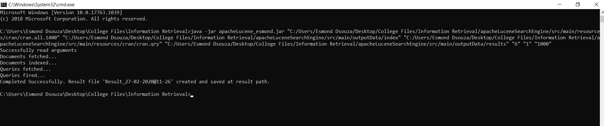

# Text Based Search Engine using Apache Lucene

Basic search engine built using Apache Lucene.

Steps to run application

Argument List
1. DOCUMENT_PATH - Path of the cran.all.1400 file containing the 1400 documents.
2. INDEX_PATH - Path to store the indices of the document.
3. QUERIES_PATH - Path of the cran.qry file containing all the queries.
4. RESULTS_PATH - Path to store the lucene searcher results 
5. Selected Analyzer - Numeric option from list of analyzers options (1 - 6)
6. Selected Similarity - Numeric option from list of similarity options(1 - 4)
7. Hits per page - Numeric string containing number.

Example list of arguments
"../cran/cran.all.1400" "../index" "../cran/cran.qry" "../results" "6" "1" "1000"

Please check below screenshot as a reference for running the program

Analyzer Options
1. Whitespace Analyzer
2. English Analyzer
3. Simple Analyzer
4. Stop Analyzer
5. Custom Analyzer
6. StandardAnalyzer

Similarity Options
1. Classic Similarity /TFIDF Similarity 
2. Boolean Similarity
3. Multi Similarity (Boolean, Classic and BM25)		        
4. BM25 Similarity 

